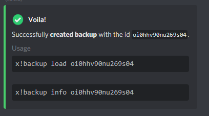

# Xenon Bot

Xenon helps you Copy or Backup your discord with just one command and take advantage of [hundreds of free templates.](https://docs.discord.club/xenon/how-to/templates) for server setup

you can only create backups of your channels, roles, permissions \(messages are premium\)

**To perform backups, please type the following.**

```text
x!backup create [chatlog]
```



If needed, you can now use the below code to recover the roles and channels

```text
 x!backup load oi0hhv90nu269s04
```


